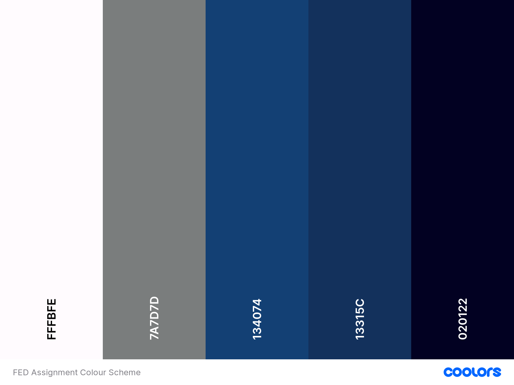

# Design and Ideation
This document outlines the thought and design process behind the creation of this website.  

## Research
I aimed to design a website that incorporated all the necessary features and functions needed for developers, whether they are just starting or have much experience in developing websites.  

Due to the time constraints and limitations surrounding this project, the developed site will only contain the landing pages meant for the promotion of the company/app and not any of the web-builder functionality.  

As part of my research, I have taken a look what are some of the essential pre-requisites to creating a website from this [website](https://digital.com/how-to-create-a-website/) and pre-existing web builders such as [Squarespace](https://www.squarespace.com/), [Wordpress](https://wordpress.org/) and [Weebly](https://www.weebly.com/sg).

## Design

### Color Scheme
The primary colour, **blue**, was chosen to represent [_freedom, imagination and inspiration_](https://www.supercolor.com/blog/the-meaning-of-the-color-blue). These are the emotions that are invoked in the user as they are creating a website, giving them the freedom to design and build anything they want.

The Colour Scheme generated using [Coolors](https://coolors.co).

### Fonts
This project uses the [Roboto](https://fonts.google.com/specimen/Roboto) Font obtained from Google Fonts.

### Wireframe
TODO: Add Wireframe