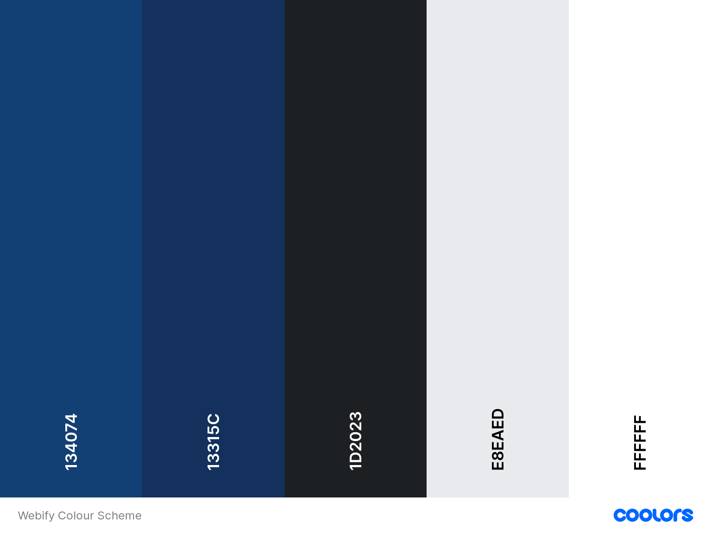
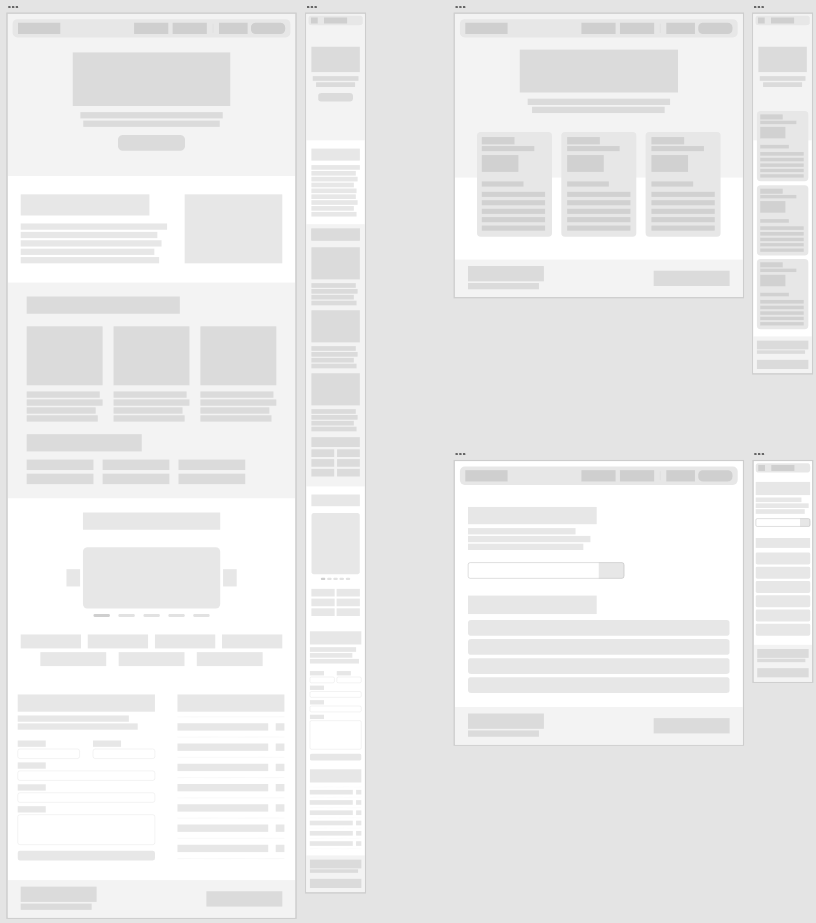

# Design Process
This document outlines the thought and design process behind the creation of this website.  

## Inspiration
When creating a website, there are many things to consider. The design, code, assets (icons and images), website hosting, domain purchase and much more. This may be overwhelming for a beginner as these tools are usually in different places but are across many websites. Using Webify, beginners can get started with their websites quickly. In addition, little web development knowledge is needed due to the drag-and-drop features. 

It also caters to more advanced users by allowing them to edit the code in the website, configure their Domain Name System (DNS), and even collaborate with others.

## Research
I aimed to design a website that incorporated all the necessary features and functions needed for people to build their dream website, whether they are just starting or have much experience in developing websites.  

Due to the time constraints and limitations surrounding this project, the developed site will only contain the landing pages meant for the promotion of the company/app and not any of the web-builder functionality.  

As part of my research, I have taken a look what are some of the essential pre-requisites to creating a website from this [website](https://digital.com/how-to-create-a-website/) and pre-existing web builders such as [Squarespace](https://www.squarespace.com/), [Wordpress](https://wordpress.org/), [Weebly](https://www.weebly.com/sg) and [Wix](https://www.wix.com/).

## Design

### Color Scheme
The primary colour, **blue**, was chosen to represent [_freedom, imagination and inspiration_](https://www.supercolor.com/blog/the-meaning-of-the-color-blue). These are the emotions that are invoked in the user as they are creating a website, giving them the freedom to design and build anything they want.

The Colour Scheme generated using [Coolors](https://coolors.co/134074-13315c-1d2023-e8eaed-ffffff).

### Fonts and Icons
This project uses the [Roboto](https://fonts.google.com/specimen/Roboto) Font obtained from Google Fonts, together with [Feather Icons](https://feathericons.com/).

### Wireframe
The Wireframe for this Project was created using Adobe XD. Three main screens are designed in the wireframe in their Desktop and Mobile look: the Landing Page, Pricing Page, and Domains Page.  

You can take a look at the [wireframe made on Adobe XD here](https://xd.adobe.com/view/8e39e14d-1ab2-4f73-a6fe-c233b51017f3-db6a/).
